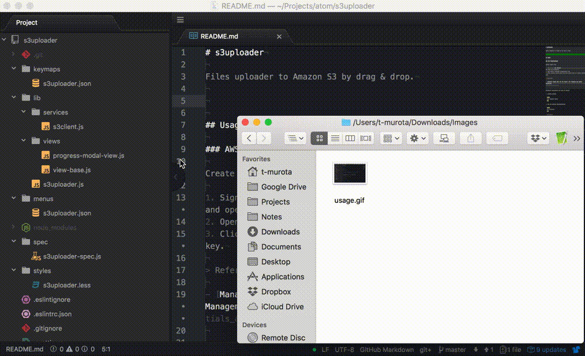
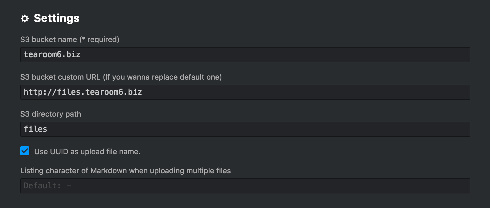

# s3uploader

Files uploader to Amazon S3 by drag & drop.

It's designed to be convenient to use with [sync-sync](https://atom.io/packages/sync-sync).




## Features

- [x] Upload files by drag & drop.
- [x] Upload files by copy & paste.
- [x] Upload files to Amazon S3.
- [ ] Support multiple destination AWS account / S3 bucket.
- [ ] Support other storage services.
- [x] Output as Markdown tag (image or link).
- [x] Output as HTML tag (image or link).


## Usage

### AWS configuration

Create access key:

1. Sign in to [AWS console](https://console.aws.amazon.com/iam/home) and open IAM dashboard.
2. Open user's [Security credentials] tab.
3. Click [Create access key], and copy access key ID / secret access key.

> References

- [Managing Access Keys for IAM Users - AWS Identity and Access Management](https://docs.aws.amazon.com/IAM/latest/UserGuide/id_credentials_access-keys.html)


Configure credentials (in case of macOS):

1. Install awscli.

  ```sh
  brew install awscli
  ```

2. Add AWS default configurations.

  ```sh
  aws configure
  ```

> References

- [Configuring the AWS CLI - AWS Command Line Interface](https://docs.aws.amazon.com/cli/latest/userguide/cli-chap-getting-started.html)


Create S3 bucket:

1. Sign in to [AWS console](https://console.aws.amazon.com/iam/home) and open S3 console.
2. Click [Create bucket] and copy bucket name.


### s3uploader configuration

After installing this package:

1. Open Atom app.
2. Click [Command] + [,] to open preferences.
3. Select [Packages] and find s3uploader, then click [Settings].
4. Set values properly like below.


